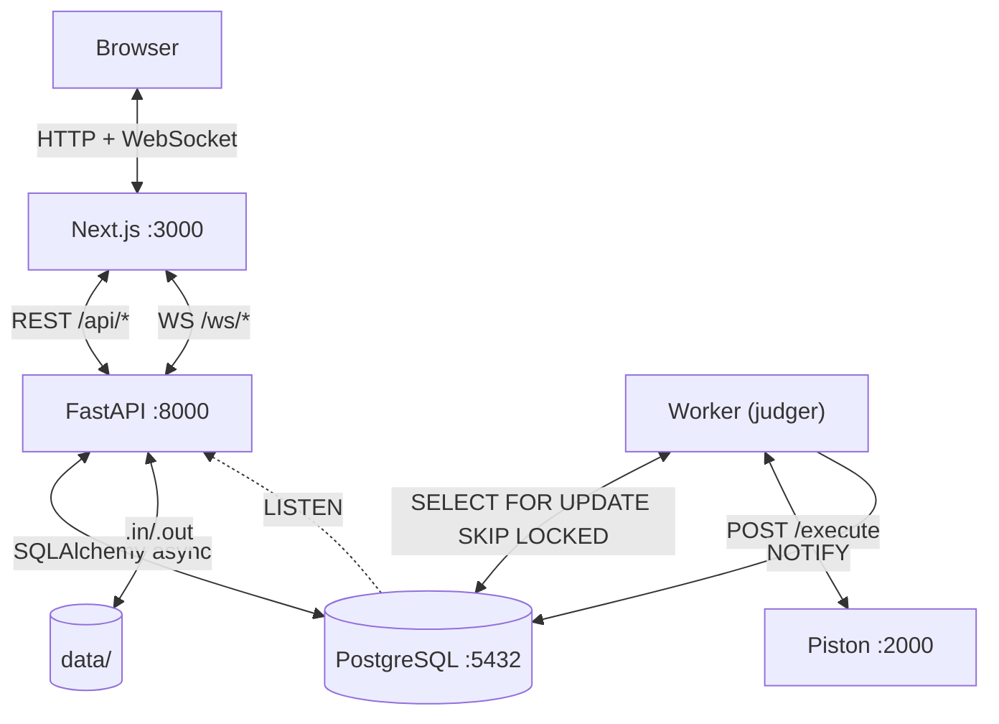

# ReInfo

[](https://github.com/dragosgatan/reinfo/actions/workflows/ci.yml)
[](LICENSE)

**[Română](#română) · [English](#english) · [Magyar](#magyar)**

---

## Română

Platformă modernă de programare competitivă pentru elevi și profesori din România. Construită pentru **InfoEducație 2026** (Secțiunea Software Educațional).

### Funcționalități

- **Probleme** — catalog cu filtrare, editor Monaco, judecată automată prin Piston, verdicte detaliate per test
- **Concursuri** — timer, clasament live prin WebSocket, tipuri: standard / temă / calificativă
- **Duele 1v1** — sistem Elo, matchmaking automat, invitații directe, resign/remiză
- **Învățare** — lecții Markdown + LaTeX, exerciții interactive, chatbot AI per lecție
- **Clase** — spații profesor–elevi cu anunțuri, teme, chat live și mesaje directe
- **Social** — profiluri publice cu heatmap activitate, prietenii, notificări în timp real
- **i18n** — română (implicit), engleză, maghiară; navigare cu tastatura; WCAG AA; responsive

### Pornire rapidă

**Cerințe:** Docker Engine 24+, Docker Compose v2.

```bash
git clone https://github.com/dragosgatan/reinfo.git
cd reinfo
docker compose up --build
```

| Serviciu | URL |
|---|---|
| Interfață | http://localhost:3000 |
| API Swagger | http://localhost:8000/api/docs |

```bash
# Prima pornire — aplică migrațiile dacă nu rulează automat
docker compose exec backend alembic upgrade head
```

Instalare detaliată → [docs/INSTALL.md](docs/INSTALL.md)

---

## English

A modern competitive programming platform for Romanian students and educators. Built for **InfoEducație 2026** (Educational Software section).

### Features

- **Problems** — searchable catalog, Monaco editor, Piston judging, per-test verdicts
- **Contests** — countdown timer, live WebSocket leaderboard, types: standard / homework / qualifier
- **1v1 Duels** — Elo rating, automatic matchmaking, direct challenges, resign/draw
- **Learning** — Markdown + LaTeX lessons, interactive exercises, per-lesson AI chatbot
- **Classrooms** — teacher–student spaces with announcements, timed homework, live chat, DMs
- **Social** — public profiles with activity heatmap, friend system, real-time notifications
- **i18n** — Romanian (default), English, Hungarian; keyboard nav; WCAG AA; responsive

### Quick start

**Requirements:** Docker Engine 24+, Docker Compose v2.

```bash
git clone https://github.com/dragosgatan/reinfo.git
cd reinfo
docker compose up --build
```

| Service | URL |
|---|---|
| UI | http://localhost:3000 |
| API Swagger | http://localhost:8000/api/docs |

```bash
# First run — apply migrations if not applied automatically
docker compose exec backend alembic upgrade head
```

Manual install → [docs/INSTALL.md](docs/INSTALL.md)

---

## Magyar

Modern versenyszerű programozási platform román diákok és pedagógusok számára. Az **InfoEducație 2026** verseny részeként fejlesztve (Oktatási Szoftver szekció).

### Funkciók

- **Feladatok** — kereshető katalógus, Monaco szerkesztő, Piston értékelés, tesztenként részletes verdikt
- **Versenyek** — visszaszámláló, élő WebSocket-ranglista, típusok: standard / házi feladat / kvalifikációs
- **1v1 Párbajok** — Elo értékelés, automatikus párosítás, közvetlen kihívások, feladás/döntetlen
- **Tanulás** — Markdown + LaTeX leckék, interaktív feladatok, leckénként AI chatbot
- **Osztályok** — tanár–diák terek: bejelentések, határidős házi feladatok, élő csevegés, közvetlen üzenetek
- **Közösségi funkciók** — nyilvános profilok, barátrendszer, valós idejű értesítések
- **Többnyelvűség** — román (alapértelmezett), angol, magyar; billentyűzetes navigáció; WCAG AA; reszponzív

### Gyors kezdés

**Követelmények:** Docker Engine 24+, Docker Compose v2.

```bash
git clone https://github.com/dragosgatan/reinfo.git
cd reinfo
docker compose up --build
```

| Szolgáltatás | URL |
|---|---|
| Felhasználói felület | http://localhost:3000 |
| API Swagger | http://localhost:8000/api/docs |

```bash
# Első indításkor — alkalmazza a migrációkat, ha nem történt meg automatikusan
docker compose exec backend alembic upgrade head
```

Telepítési útmutató → [docs/INSTALL.md](docs/INSTALL.md)

---

## Architecture



Cross-process sync uses **PostgreSQL `NOTIFY/LISTEN`** — no Redis, no external broker.

---

## Tech Stack

| Component | Technology |
|---|---|
| Backend | FastAPI 0.115 + Python 3.11, SQLAlchemy 2.0 async, Alembic |
| Database | PostgreSQL 16 (ACID, NOTIFY/LISTEN, SKIP LOCKED) |
| Code execution | Piston (self-hosted Docker sandbox) |
| Frontend | Next.js 14 App Router + TypeScript, Tailwind CSS + shadcn/ui |
| Editor | Monaco Editor |
| Auth | HTTP-only cookies + itsdangerous |
| Real-time | WebSocket + PostgreSQL NOTIFY |
| i18n | next-intl |

---

## Documentation

| Document | Contents |
|---|---|
| [docs/INSTALL.md](docs/INSTALL.md) | Install, env vars, Piston runtimes, production |
| [docs/ARCHITECTURE.md](docs/ARCHITECTURE.md) | Diagrams, database schema, code structure |
| [docs/API.md](docs/API.md) | REST + WebSocket endpoint reference |
| [docs/CONTRIBUTING.md](docs/CONTRIBUTING.md) | Dev setup, code standards, Git workflow |
| [docs/SECURITY.md](docs/SECURITY.md) | Auth model, rate limiting, production checklist |
| [docs/USER_GUIDE.md](docs/USER_GUIDE.md) | User guide (Romanian) |

---

## Contributing

```bash
# Backend
cd backend && uv pip install -e ".[dev]" && cp .env.example .env
alembic upgrade head && uvicorn app.main:app --reload

# Frontend
cd frontend && npm install && npm run dev

# Before pushing
cd backend && ruff check . --fix && ruff format . && pytest -v
cd frontend && npm run lint && npm run typecheck
```

---

## License

MIT © 2026 Dragos Gatan
