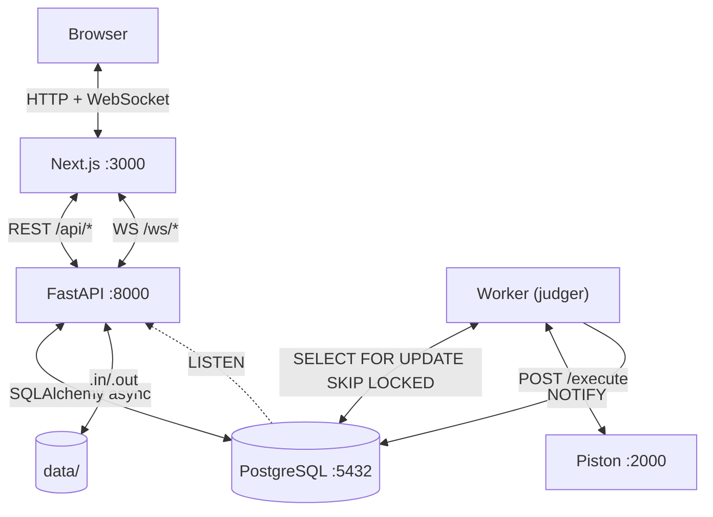

# ReInfo

[](https://github.com/dragosgatan/reinfo/actions/workflows/ci.yml)
[](LICENSE)

Platformă modernă de programare competitivă pentru elevi și profesori din România. Construită pentru **InfoEducație 2026** (Secțiunea Software Educațional).

### Funcționalități

- **Probleme** - catalog cu filtrare, editor Monaco, judecată automată prin Piston, verdicte detaliate per test
- **Probleme AI** - tip de problemă dataset/ML, submisie predicții evaluate prin metrici (accuracy, F1, RMSE, MAE), acces prin CLI
- **Concursuri** - timer, clasament live prin WebSocket, tipuri: concurs / test de clasă
- **CTF** - provocări de securitate pe categorii (web, crypto, pwn, reverse, forensics, OSINT, diverse), hint-uri, scoreboard
- **Duele 1v1** - sistem Elo, matchmaking automat, invitații directe, resign/remiză
- **Învățare** - lecții Markdown + LaTeX, exerciții interactive, chatbot AI per lecție
- **Hărți de parcurs** - trasee de învățare tip skill-tree, cu progres per nod
- **Pregătire** - trasee structurate de pregătire pentru fiecare olimpiadă
- **Clase** - spații profesor–elevi cu anunțuri, teme, chat live și mesaje directe
- **Proiecte** - teme deschise atribuite de profesori, submisie prin link GitHub, notare
- **Social** - profiluri publice cu heatmap activitate, prietenii, notificări în timp real
- **Admin** - panou de administrare: utilizatori, statistici, monitorizare platformă
- **CLI** - client de linie de comandă (nepublicat încă pe PyPI, instalabil din `cli/`) pentru submisii, scaffolding și acces la seturi de date AI
- **i18n** - română (implicit), engleză, maghiară; navigare cu tastatura; WCAG AA; responsive

### Pornire rapidă

**Cerințe:** Docker Engine 24+, Docker Compose v2.

```bash
git clone https://github.com/dragosgatan/reinfo.git
cd reinfo
docker compose up --build
```

| Serviciu | URL |
|---|---|
| Interfață | http://localhost:3000 |
| API Swagger | http://localhost:8000/api/docs |

```bash
# Prima pornire - aplică migrațiile dacă nu rulează automat
docker compose exec backend alembic upgrade head
```

Instalare detaliată → [docs/INSTALL.md](docs/INSTALL.md)

---

## Architecture



Cross-process sync uses **PostgreSQL `NOTIFY/LISTEN`**.

---

## Tech Stack

| Component | Technology |
|---|---|
| Backend | FastAPI 0.115 + Python 3.11, SQLAlchemy 2.0 async, Alembic |
| Database | PostgreSQL 16 (ACID, NOTIFY/LISTEN, SKIP LOCKED) |
| Code execution | Piston (self-hosted Docker sandbox) |
| Frontend | Next.js 14 App Router + TypeScript, Tailwind CSS + shadcn/ui |
| Editor | Monaco Editor |
| Auth | HTTP-only cookies + itsdangerous |
| Real-time | WebSocket + PostgreSQL NOTIFY |
| i18n | next-intl |
| AI | OpenRouter (DeepSeek), per-user rate limiting + email verification + ip rate limiting + response caching  |
| CLI | Click (Python); PyPI package


## License

MIT © 2026 Dragos Gatan
