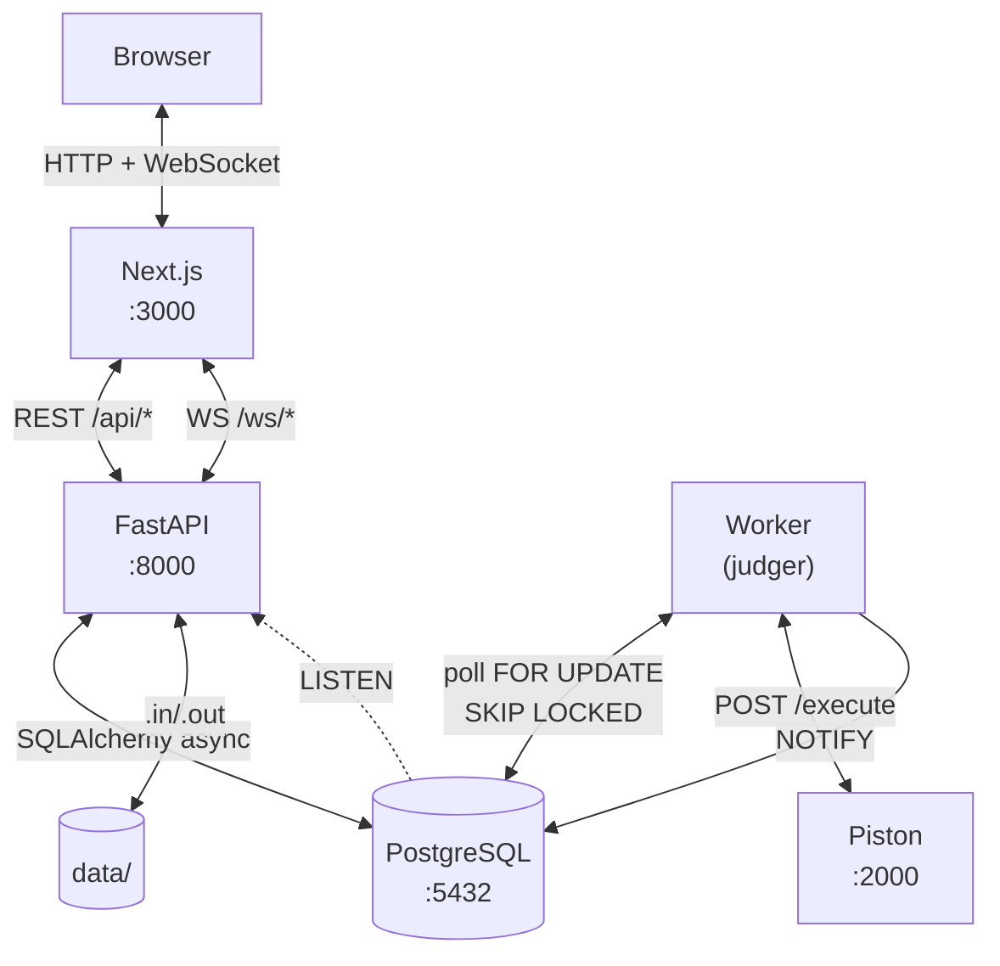

# ReInfo

[](https://github.com/dragosgatan/reinfo/actions/workflows/ci.yml)
[](LICENSE)
[](https://www.python.org/)
[](https://nodejs.org/)
[](https://fastapi.tiangolo.com/)
[](https://nextjs.org/)

---

**[Română](#română) · [English](#english) · [Magyar](#magyar)**

---

## Română

**Platformă modernă de programare competitivă pentru elevi și profesori din România.**

ReInfo este o reimaginare a platformelor clasice de algoritmică (pbinfo, infoarena) cu accent pe experiența utilizatorului, integrarea nativă a limbajului Python, funcționalități în timp real și suport pedagogic integrat. Construit pentru **InfoEducație 2026** (Secțiunea Software Educațional).

### Funcționalități

**Rezolvare probleme**
- Catalog cu filtrare după dificultate (1–10), etichete și căutare full-text
- Editor **Monaco** integrat — același engine ca VS Code, pentru 9 limbaje
- Judecată automată server-side prin **Piston** (sandbox Docker izolat)
- Verdicte detaliate per test: AC, WA, CE, TLE, MLE, RE
- Trei moduri de comparare: `exact`, `whitespace_insensitive`, `float_epsilon`

**Concursuri**
- Concursuri publice și private cu timer countdown
- Clasament **live** prin WebSocket — fără refresh
- Tipuri: concurs standard, temă cu termen, calificativă

**Duele 1v1**
- Sistem de rating **Elo** (similar șahului), coadă automată de matchmaking
- Invitații directe, opțiuni resign și remiză, grafic evoluție rating

**Învățare**
- Lecții cu Markdown + LaTeX (KaTeX), exemple de cod, exerciții interactive
- **Chatbot AI** contextualizat per lecție; tracking progres pe profil

**Clase**
- Spații profesor–elevi cu anunțuri, teme cu termen, chat live și mesaje directe
- Urmărirea progresului individual al elevilor de către profesor

**Social & Profil**
- Profiluri publice: heatmap activitate, statistici, rating duel, istoric submisii
- Sistem de prieteni cu notificări în timp real; filtrare clasament după prieteni

**Accesibilitate & Internaționalizare**
- Limbă implicită: **română**; disponibil în **engleză** și **maghiară**
- Navigare completă cu tastatura, etichete ARIA, contrast WCAG AA
- Responsive pe mobile, tabletă și desktop

### Pornire rapidă

**Cerințe:** Docker Engine 24+ și Docker Compose v2.

```bash
git clone https://github.com/dragosgatan/reinfo.git
cd reinfo
docker compose up --build
```

| Serviciu | URL |
|---|---|
| Interfață | http://localhost:3000 |
| API Swagger | http://localhost:8000/api/docs |

```bash
# La prima pornire — aplică migrațiile (dacă nu se aplică automat)
docker compose exec backend alembic upgrade head
```

Instalare fără Docker sau configurare în producție → [docs/INSTALL.md](docs/INSTALL.md).

---

## English

**A modern competitive programming platform for Romanian students and educators.**

ReInfo reimagines classic algorithmics platforms (pbinfo, infoarena) with a focus on user experience, native Python integration, real-time features, and built-in pedagogical support. Built for **InfoEducație 2026** (Educational Software section).

### Features

**Problem solving**
- Searchable catalog with difficulty (1–10), tag filtering, and full-text search
- Integrated **Monaco editor** — the same engine as VS Code, for 9 languages
- Automatic server-side judging via **Piston** (isolated Docker sandbox)
- Per-test verdicts: AC, WA, CE, TLE, MLE, RE
- Three output comparison modes: `exact`, `whitespace_insensitive`, `float_epsilon`

**Contests**
- Public and private contests with countdown timer
- **Live leaderboard** over WebSocket — no page refresh needed
- Types: standard contest, deadline homework, qualifier round

**1v1 Duels**
- **Elo rating system** (chess-style), automatic matchmaking queue
- Direct challenges, resign and draw options, rating history graph

**Learning**
- Lessons with Markdown + LaTeX (KaTeX), code examples, interactive exercises
- **AI chatbot** contextualized per lesson; progress tracking on profile

**Classrooms**
- Teacher–student spaces with announcements, timed homework, live chat, DMs
- Teachers can track each student's individual progress

**Social & Profiles**
- Public profiles: activity heatmap, stats, duel rating, submission history
- Friend system with real-time notifications; leaderboard filter by friends

**Accessibility & i18n**
- Default language: **Romanian**; available in **English** and **Hungarian**
- Full keyboard navigation, ARIA labels, WCAG AA contrast
- Responsive on mobile, tablet, and desktop

### Quick start

**Requirements:** Docker Engine 24+ and Docker Compose v2.

```bash
git clone https://github.com/dragosgatan/reinfo.git
cd reinfo
docker compose up --build
```

| Service | URL |
|---|---|
| UI | http://localhost:3000 |
| API Swagger | http://localhost:8000/api/docs |

```bash
# First run — apply migrations (if not applied automatically)
docker compose exec backend alembic upgrade head
```

Manual install or production setup → [docs/INSTALL.md](docs/INSTALL.md).

---

## Magyar

**Modern versenyszerű programozási platform román diákok és pedagógusok számára.**

A ReInfo újragondolja a klasszikus algoritmusplatformokat (pbinfo, infoarena), hangsúlyt fektetve a felhasználói élményre, a Python nyelv natív integrációjára, a valós idejű funkciókra és a beépített pedagógiai támogatásra. Az **InfoEducație 2026** verseny részeként fejlesztve (Oktatási Szoftver szekció).

### Funkciók

**Feladatmegoldás**
- Kereshető katalógus nehézségi szint (1–10), címkék és teljes szöveges keresés alapján
- Integrált **Monaco szerkesztő** — ugyanaz az engine, mint a VS Code-ban, 9 nyelvhez
- Automatikus szerveroldali értékelés **Piston** segítségével (izolált Docker sandbox)
- Tesztenként részletes verdikt: AC, WA, CE, TLE, MLE, RE
- Három kimeneti összehasonlítási mód: `exact`, `whitespace_insensitive`, `float_epsilon`

**Versenyek**
- Nyilvános és privát versenyek visszaszámlálóval
- **Élő ranglista** WebSocket-en keresztül — oldal-frissítés nélkül
- Típusok: standard verseny, határidős házi feladat, kvalifikációs forduló

**1v1 Párbajok**
- **Elo értékelési rendszer** (sakk-stílusú), automatikus párosítási sor
- Közvetlen kihívások, feladás és döntetlen lehetőség, értékelési előzmények grafikonja

**Tanulás**
- Leckék Markdown + LaTeX (KaTeX) formátumban, kódpéldákkal, interaktív feladatokkal
- **AI chatbot** leckénként kontextualizálva; haladás nyomon követése a profilon

**Osztályok**
- Tanár–diák terek: bejelentések, határidős házi feladatok, élő csevegés, közvetlen üzenetek
- A tanár nyomon követheti az egyes diákok egyéni előrehaladását

**Közösségi funkciók & Profil**
- Nyilvános profilok: aktivitás hőtérkép, statisztikák, párbaj-értékelés, beküldési előzmények
- Barátrendszer valós idejű értesítésekkel; ranglista szűrése barátok szerint

**Akadálymentesség & Többnyelvűség**
- Alapértelmezett nyelv: **román**; elérhető **angolul** és **magyarul**
- Teljes billentyűzetes navigáció, ARIA-címkék, WCAG AA kontraszt
- Reszponzív megjelenés mobilon, tableten és asztali számítógépen

### Gyors kezdés

**Követelmények:** Docker Engine 24+ és Docker Compose v2.

```bash
git clone https://github.com/dragosgatan/reinfo.git
cd reinfo
docker compose up --build
```

| Szolgáltatás | URL |
|---|---|
| Felhasználói felület | http://localhost:3000 |
| API Swagger | http://localhost:8000/api/docs |

```bash
# Első indításkor — alkalmazza a migrációkat (ha nem történt meg automatikusan)
docker compose exec backend alembic upgrade head
```

Docker nélküli telepítés vagy éles üzemi konfiguráció → [docs/INSTALL.md](docs/INSTALL.md).

---

## Architecture



Judging flow: user writes code in Monaco → submit → worker sends it to Piston → compares stdout against the `.out` file → verdict delivered via WebSocket in seconds, no refresh.

Cross-process sync (worker → FastAPI → browser) uses **PostgreSQL `NOTIFY/LISTEN`** — no Redis, no external broker.

Full diagrams (sequence, WebSocket, ER schema) → [docs/ARCHITECTURE.md](docs/ARCHITECTURE.md).

---

## Tech Stack

| Component | Technology | Reason |
|---|---|---|
| Backend | FastAPI 0.115 + Python 3.11 | Async-first, automatic OpenAPI docs, Pydantic v2 |
| ORM | SQLAlchemy 2.0 async + Alembic | Async sessions, versioned migrations |
| Database | PostgreSQL 16 | ACID, `NOTIFY/LISTEN`, `SKIP LOCKED` |
| Code execution | Piston (self-hosted Docker) | Multi-language sandbox, no per-execution cost |
| Frontend | Next.js 14 App Router + TypeScript | Server Components for SEO, Client for real-time |
| Styling | Tailwind CSS + shadcn/ui | Zero runtime CSS, accessible Radix UI components |
| Editor | Monaco Editor | Same engine as VS Code |
| Validation | Pydantic v2 + Zod | End-to-end type safety from API to form |
| Auth | HTTP-only cookies + itsdangerous | Tokens never exposed to JS; SameSite=Strict |
| Real-time | WebSocket + PostgreSQL NOTIFY | Live leaderboard, duels, notifications — no Redis |
| i18n | next-intl | Native App Router integration, locale in URL |

---

## Project Structure

```
reinfo/
├── backend/
│   ├── app/
│   │   ├── models/      # SQLAlchemy ORM — 11 entities
│   │   ├── routers/     # 8 routers, 80+ REST + WS endpoints
│   │   ├── schemas/     # Pydantic request/response
│   │   ├── judging.py   # Output comparison, score calculation
│   │   ├── worker.py    # Job processor (Piston, Elo rating)
│   │   └── realtime.py  # WebSocket hubs + NOTIFY listener
│   └── tests/           # pytest — 11 files, 300+ test cases
├── frontend/
│   └── src/
│       ├── app/[locale]/ # Next.js pages (App Router + i18n)
│       ├── components/   # UI components (shadcn + custom)
│       └── lib/          # API client, Zod types, React hooks
├── data/                 # .in/.out files and avatars (gitignored)
├── docs/                 # Detailed documentation
└── .github/workflows/    # CI: pytest + ruff + ESLint + tsc + build
```

---

## Documentation

| Document | Contents |
|---|---|
| [docs/INSTALL.md](docs/INSTALL.md) | Step-by-step install, env vars, Piston runtimes, production |
| [docs/ARCHITECTURE.md](docs/ARCHITECTURE.md) | Mermaid diagrams, tech justifications, database schema |
| [docs/API.md](docs/API.md) | Full REST + WebSocket reference with request/response examples |
| [docs/CONTRIBUTING.md](docs/CONTRIBUTING.md) | Dev setup, code standards, Git workflow, PR checklist |
| [docs/SECURITY.md](docs/SECURITY.md) | Auth model, rate limiting, vulnerability reporting |
| [docs/USER_GUIDE.md](docs/USER_GUIDE.md) | Full user guide (in Romanian) |

---

## Contributing

```bash
# Backend
cd backend
uv pip install -e ".[dev]"
cp .env.example .env
alembic upgrade head
uvicorn app.main:app --reload

# Frontend (separate terminal)
cd frontend
npm install
npm run dev

# Before pushing
cd backend && ruff check . --fix && ruff format . && pytest -v
cd frontend && npm run lint && npm run typecheck
```

Full guide, commit conventions, and PR checklist → [docs/CONTRIBUTING.md](docs/CONTRIBUTING.md).

---

## License

MIT © 2026 Dragos Gatan
