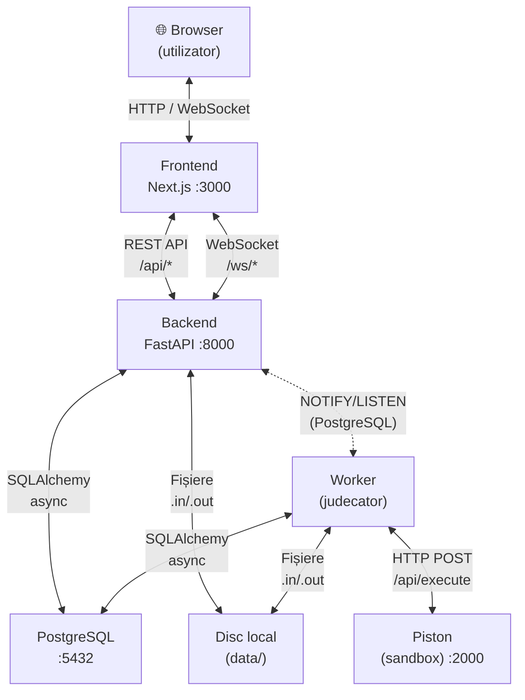
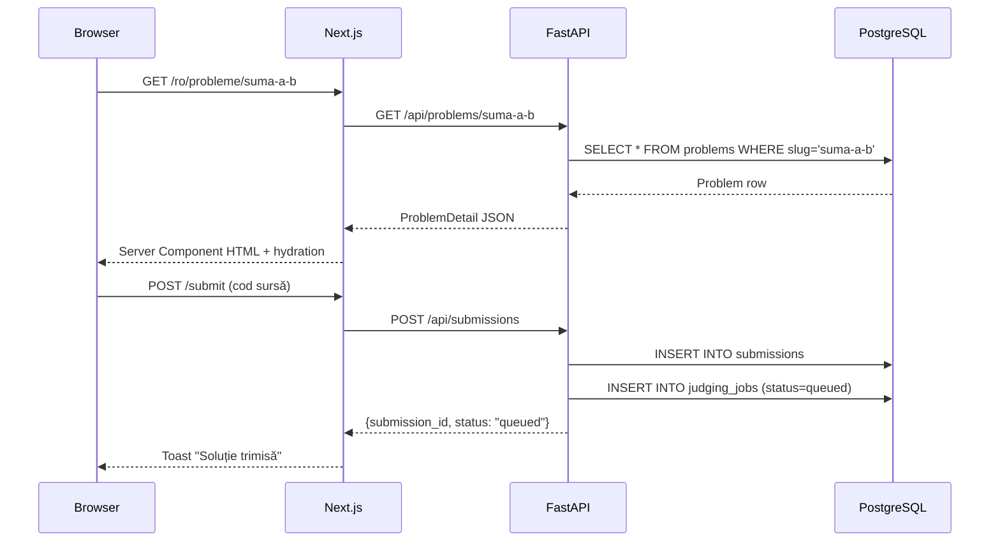
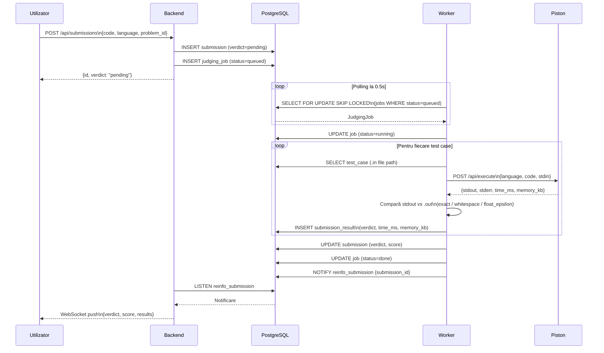
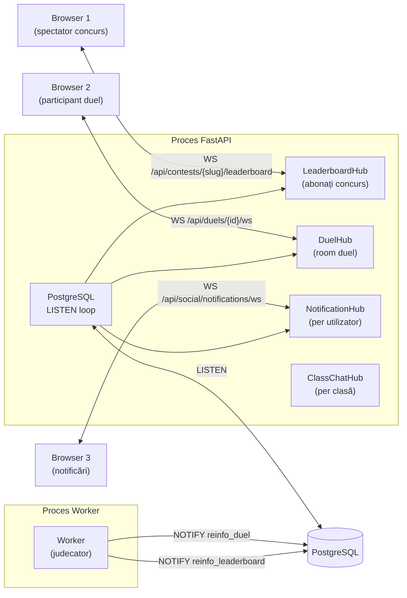
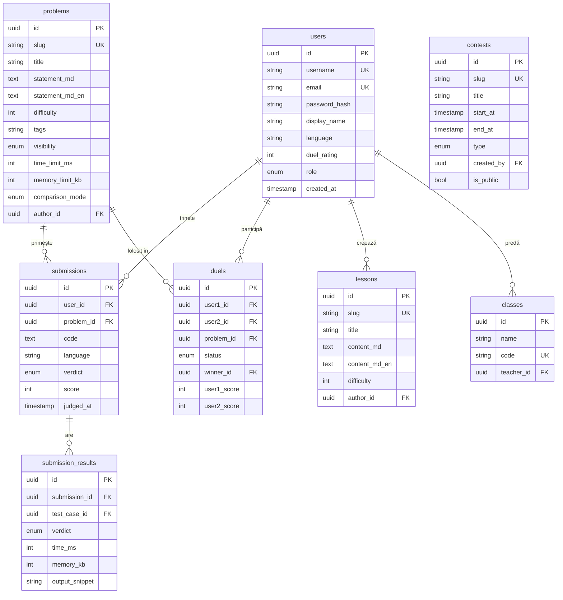

# Arhitectura ReInfo

## Cuprins

- [Prezentare generală](#prezentare-generală)
- [Diagrama serviciilor](#diagrama-serviciilor)
- [Flux de cereri HTTP](#flux-de-cereri-http)
- [Pipeline de judecată](#pipeline-de-judecată)
- [Arhitectura WebSocket](#arhitectura-websocket)
- [Schema bazei de date](#schema-bazei-de-date)
- [Stiva tehnologică – justificări](#stiva-tehnologică--justificări)
- [Structura codului](#structura-codului)

---

## Prezentare generală

ReInfo este un monorepo cu trei componente principale care comunică prin HTTP și WebSocket:

- **Frontend** – Next.js 14 (App Router), servit pe portul 3000
- **Backend** – FastAPI (Python 3.11+), servit pe portul 8000
- **Worker** – proces Python separat care procesează coada de judecată
- **Piston** – motor sandbox de execuție cod (Docker), portul 2000
- **PostgreSQL 16** – baza de date principală, portul 5432

---

## Diagrama serviciilor



---

## Flux de cereri HTTP

Cerere tipică de la browser la baza de date:



---

## Pipeline de judecată

Fluxul complet de la trimiterea codului la afișarea verdictului:



### Tipuri de verdicte

| Verdict | Cod | Condiție |
|---|---|---|
| Accepted | `AC` | Toate testele trecute |
| Wrong Answer | `WA` | Output diferit de cel corect |
| Compile Error | `CE` | Piston raportează eroare de compilare |
| Time Limit Exceeded | `TLE` | Timp de execuție > limita problemei |
| Memory Limit Exceeded | `MLE` | Memorie folosită > limita problemei |
| Runtime Error | `RE` | Segfault, excepție, exit code != 0 |

### Moduri de comparare output

| Mod | Comportament |
|---|---|
| `exact` | Comparare byte cu byte |
| `whitespace_insensitive` | Ignoră spații extra și newline-uri |
| `float_epsilon` | Parsează numerele float, toleranță ±10⁻⁶ |

---

## Arhitectura WebSocket

ReInfo folosește WebSocket-uri pentru actualizări în timp real. Sincronizarea între procese se face prin PostgreSQL `NOTIFY/LISTEN` — fără Redis sau alt broker.



### Canale NOTIFY

| Canal | Emis de | Primit de | Conținut |
|---|---|---|---|
| `reinfo_submission` | Worker | Backend | `{submission_id, verdict}` |
| `reinfo_leaderboard` | Backend | LeaderboardHub | `{contest_id, user_id, score}` |
| `reinfo_duel` | Backend/Worker | DuelHub | `{duel_id, event, payload}` |
| `reinfo_notifications` | Backend | NotificationHub | `{user_id, notification}` |
| `reinfo_class_chat` | Backend | ClassChatHub | `{class_id, message}` |

---

## Schema bazei de date



---

## Stiva tehnologică – justificări

### Backend: FastAPI (Python 3.11+)

- **Async-first** – `asyncpg` + `aiofiles` pentru I/O concurent fără blocare; esențial pentru WebSocket-uri și polling-ul workerului
- **OpenAPI automat** – fiecare endpoint este documentat fără efort suplimentar; folosit de evaluatorii InfoEducație pentru verificarea API-ului
- **Pydantic v2** – validare la runtime + generare de scheme JSON automate; tipuri partajate cu frontend-ul prin Zod

### ORM: SQLAlchemy 2.0 + Alembic

- **API declarativ async** – sesiuni async cu `AsyncSession`, query-uri type-safe
- **Alembic** – migrații versionate, history reproducibil; critică pentru un proiect cu schema în continuă evoluție
- Alternativa (`SQLModel`) nu suporta complet async la momentul alegerii

### Baza de date: PostgreSQL 16

- **ACID** – esențial pentru scoring corect la concursuri
- **`NOTIFY/LISTEN`** – sincronizare cross-proces fără Redis; simplifică infrastructura
- **`SELECT FOR UPDATE SKIP LOCKED`** – job queue robustă fără un broker extern
- **jsonb** – stocare flexibilă pentru metadata (tags, opțiuni quiz)

### Frontend: Next.js 14 (App Router)

- **Server Components** – pagini publice (probleme, concursuri) indexabile SEO fără JS suplimentar în browser
- **Client Components** – editor Monaco, WebSocket-uri, formulare interactive unde e nevoie
- **File-based routing** – corespunde direct URL-urilor platformei; ușor de navigat
- **Built-in i18n support** – `next-intl` integrat nativ cu App Router

### Styling: Tailwind CSS + shadcn/ui

- **Tailwind** – design tokens consistente, zero runtime CSS; bundle mic
- **shadcn/ui** – componente accesibile (Radix UI) fără o dependință suplimentară de runtime; codul componentelor e în repo și poate fi modificat
- **Nu**: Bootstrap, MUI, Chakra — prea opinionated pentru designul editorial dorit

### Editor: Monaco Editor

- Același engine ca VS Code — utilizatorii cunosc deja interfața
- Suportă 50+ limbaje out-of-the-box
- `@monaco-editor/react` — integrare simplă în React

### Auth: itsdangerous + HTTP-only cookies

- **Fără JWT** — token-urile JWT în `localStorage` sunt vulnerabile la XSS; cookie-urile HTTP-only nu sunt accesibile din JavaScript
- **`SameSite=Strict`** — protecție CSRF fără un token separat
- **itsdangerous** — semnare + verificare rapidă, fără dependință externă

### Execuție cod: Piston

- **Sandbox Docker** — fiecare execuție rulează izolat, fără acces la sistemul host
- **Multi-limbaj** — C, C++, Python, Java, Rust, Go, JavaScript, Kotlin, PyPy
- **REST API simplu** — `POST /api/execute` cu `{code, language, stdin}` → `{stdout, stderr, time_ms}`
- Self-hosted — nu există costuri per-execuție și datele nu ies din infrastractura proprie

---

## Structura codului

```
reinfo/
├── backend/
│   ├── app/
│   │   ├── main.py          # Inițializare FastAPI, înregistrare routere, lifespan
│   │   ├── config.py        # Pydantic Settings (variabile de mediu)
│   │   ├── db.py            # Engine async + factory sesiuni
│   │   ├── security.py      # bcrypt, generare token sesiune
│   │   ├── dependencies.py  # get_current_user, get_db (DI FastAPI)
│   │   ├── judging.py       # Logică de comparare output, calcul scor
│   │   ├── worker.py        # Job processor (polling, Piston, Elo)
│   │   ├── realtime.py      # WebSocket hubs, NOTIFY listener
│   │   ├── piston.py        # Client HTTP Piston
│   │   ├── storage.py       # Scriere/citire fișiere .in/.out
│   │   ├── models/          # SQLAlchemy ORM (11 entități)
│   │   ├── routers/         # Handlere HTTP (8 routere, 80+ endpoint-uri)
│   │   └── schemas/         # Pydantic request/response (validare + serializare)
│   └── tests/               # pytest (11 fișiere, 300+ teste)
├── frontend/
│   └── src/
│       ├── app/[locale]/    # Pagini Next.js (App Router, i18n)
│       ├── components/      # Componente UI reutilizabile (shadcn + custom)
│       ├── lib/
│       │   ├── api.ts       # Fetch wrapper cu validare Zod
│       │   ├── types.ts     # Scheme Zod pentru toate tipurile API
│       │   └── use-*.ts     # React hooks (WebSocket, query, auth)
│       └── messages/        # Fișiere traduceri (ro.json, en.json)
├── data/                    # .in/.out, avatare (gitignored)
├── docs/                    # Documentație
└── .github/workflows/ci.yml # CI: pytest + ruff + ESLint + tsc + build
```
