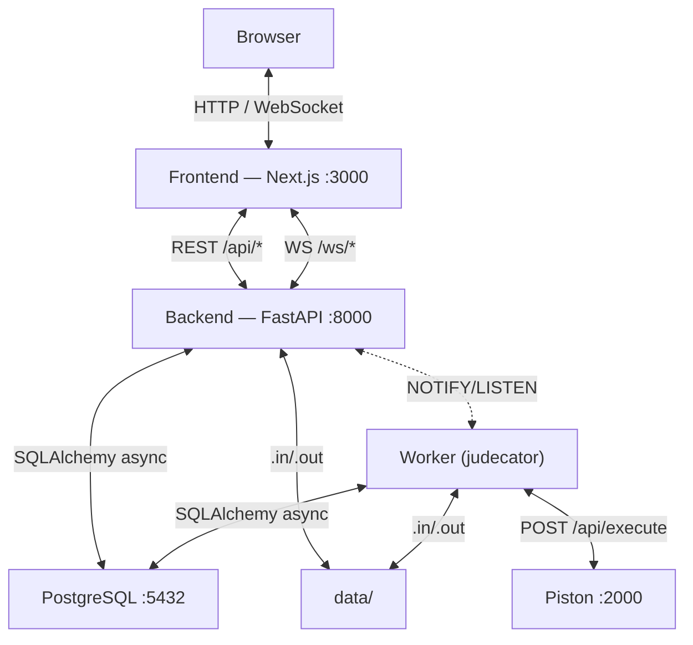
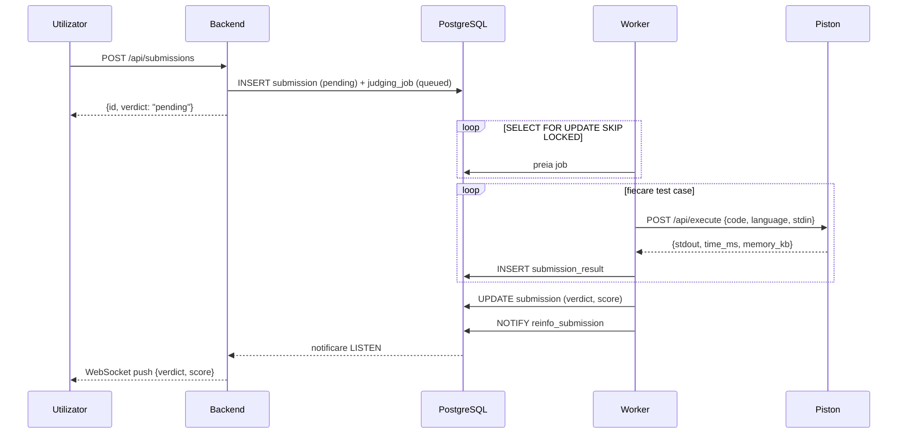

# Arhitectura ReInfo

## Servicii



Sincronizarea cross-proces (Worker → FastAPI → browser) folosește **PostgreSQL `NOTIFY/LISTEN`** — fără Redis.

---

## Pipeline de judecată



### Verdicte

| Cod | Condiție |
|---|---|
| `AC` | Toate testele trecute |
| `WA` | Output diferit de cel corect |
| `CE` | Eroare de compilare |
| `TLE` | Depășit limita de timp |
| `MLE` | Depășit limita de memorie |
| `RE` | Eroare la execuție |

### Moduri de comparare

| Mod | Comportament |
|---|---|
| `exact` | Byte cu byte |
| `whitespace_insensitive` | Ignoră spații și newline-uri extra |
| `float_epsilon` | Toleranță ±10⁻⁶ pentru numere float |

---

## WebSocket

```mermaid
graph LR
    subgraph "Proces FastAPI"
        LH["LeaderboardHub"]
        DH["DuelHub"]
        NH["NotificationHub"]
        CH["ClassChatHub"]
        PL["LISTEN loop"]
    end

    WK["Worker"] -->|NOTIFY| DB[(PostgreSQL)]
    PL <-->|LISTEN| DB
    PL --> LH & DH & NH

    B1["Browser"] <-->|WS /api/contests/{slug}/leaderboard| LH
    B2["Browser"] <-->|WS /api/duels/{id}/ws| DH
    B3["Browser"] <-->|WS /api/social/notifications/ws| NH
```

| Canal | Emis de | Conținut |
|---|---|---|
| `reinfo_submission` | Worker | `{submission_id, verdict}` |
| `reinfo_leaderboard` | Backend | `{contest_id, user_id, score}` |
| `reinfo_duel` | Backend/Worker | `{duel_id, event, payload}` |
| `reinfo_notifications` | Backend | `{user_id, notification}` |

---

## Schema bazei de date

```mermaid
erDiagram
    users {
        uuid id PK
        string username UK
        string email UK
        string password_hash
        string display_name
        string language
        int duel_rating
        enum role
        timestamp created_at
    }
    problems {
        uuid id PK
        string slug UK
        string title
        text statement_md
        int difficulty
        string tags
        enum visibility
        int time_limit_ms
        int memory_limit_kb
        enum comparison_mode
        uuid author_id FK
    }
    submissions {
        uuid id PK
        uuid user_id FK
        uuid problem_id FK
        text code
        string language
        enum verdict
        int score
        timestamp judged_at
    }
    submission_results {
        uuid id PK
        uuid submission_id FK
        uuid test_case_id FK
        enum verdict
        int time_ms
        int memory_kb
    }
    contests { uuid id PK; string slug UK; timestamp start_at; timestamp end_at; enum type }
    duels { uuid id PK; uuid user1_id FK; uuid user2_id FK; uuid problem_id FK; enum status }
    lessons { uuid id PK; string slug UK; text content_md; int difficulty }
    classes { uuid id PK; string code UK; uuid teacher_id FK }

    users ||--o{ submissions : ""
    problems ||--o{ submissions : ""
    submissions ||--o{ submission_results : ""
    users ||--o{ duels : ""
    problems ||--o{ duels : ""
```

---

## Structura codului

```
backend/app/
├── main.py          # inițializare FastAPI, lifespan
├── config.py        # Pydantic Settings
├── db.py            # engine async + sesiuni
├── security.py      # bcrypt, token sesiune
├── dependencies.py  # get_current_user, get_db
├── judging.py       # comparare output, calcul scor
├── worker.py        # job processor (Piston, Elo)
├── realtime.py      # WebSocket hubs, NOTIFY listener
├── piston.py        # client HTTP Piston
├── storage.py       # citire/scriere .in/.out
├── models/          # SQLAlchemy ORM (11 entități)
├── routers/         # 8 routere, 80+ endpoint-uri
└── schemas/         # Pydantic request/response

frontend/src/
├── app/[locale]/    # pagini Next.js App Router
├── components/      # UI (shadcn + custom)
└── lib/
    ├── api.ts       # fetch wrapper cu Zod
    ├── types.ts     # scheme Zod
    └── use-*.ts     # React hooks
```
